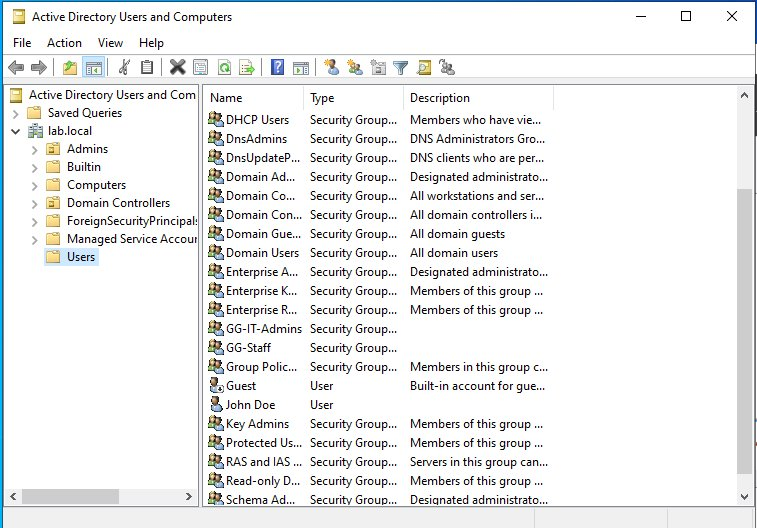
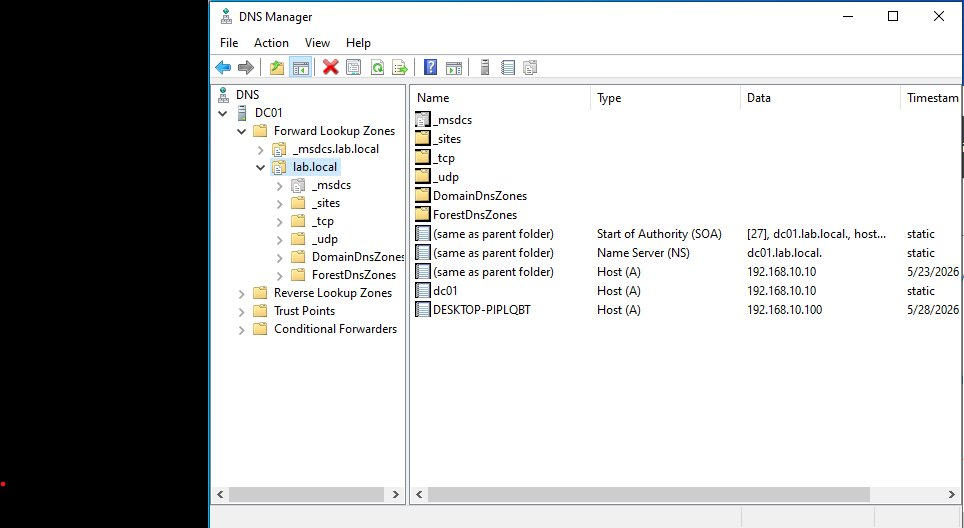
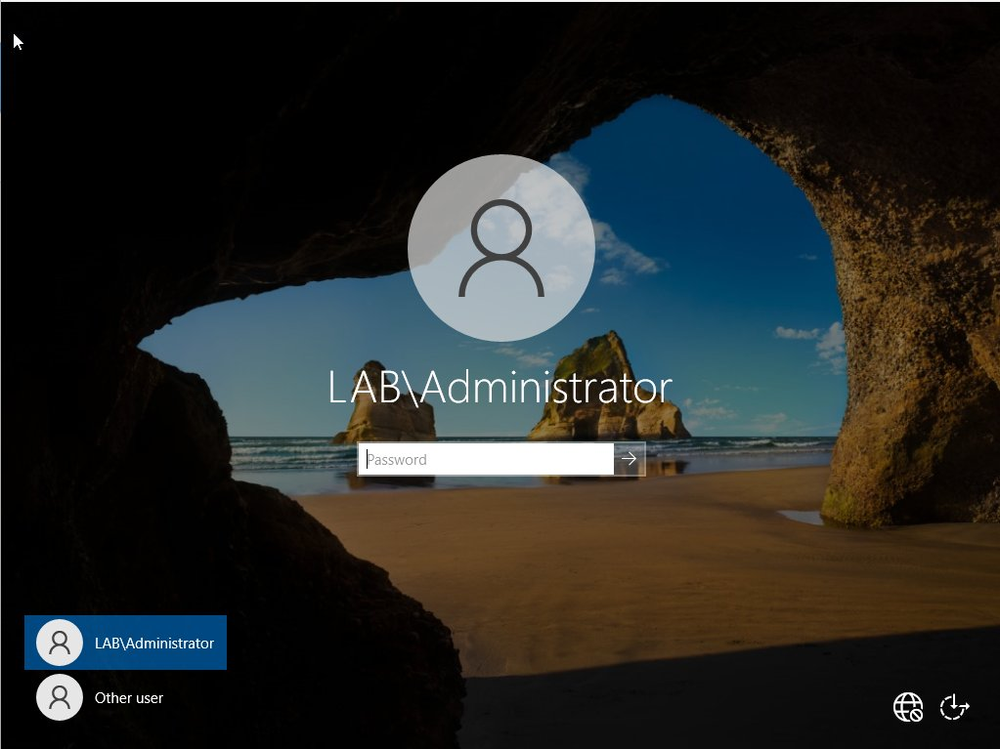
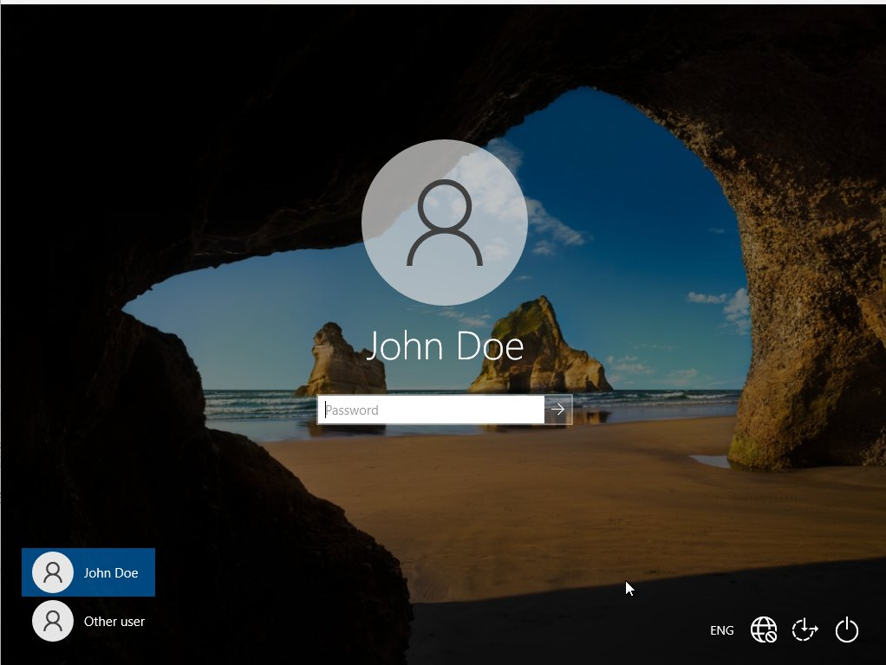
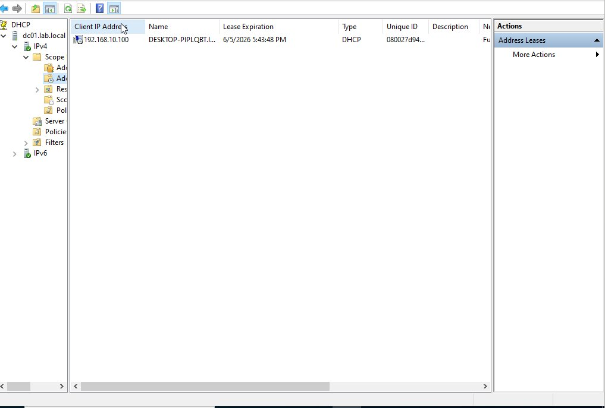
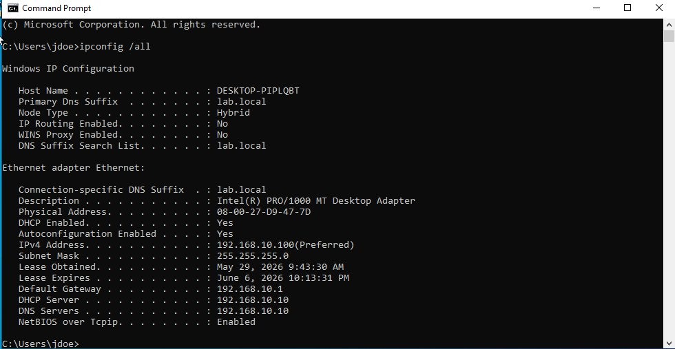
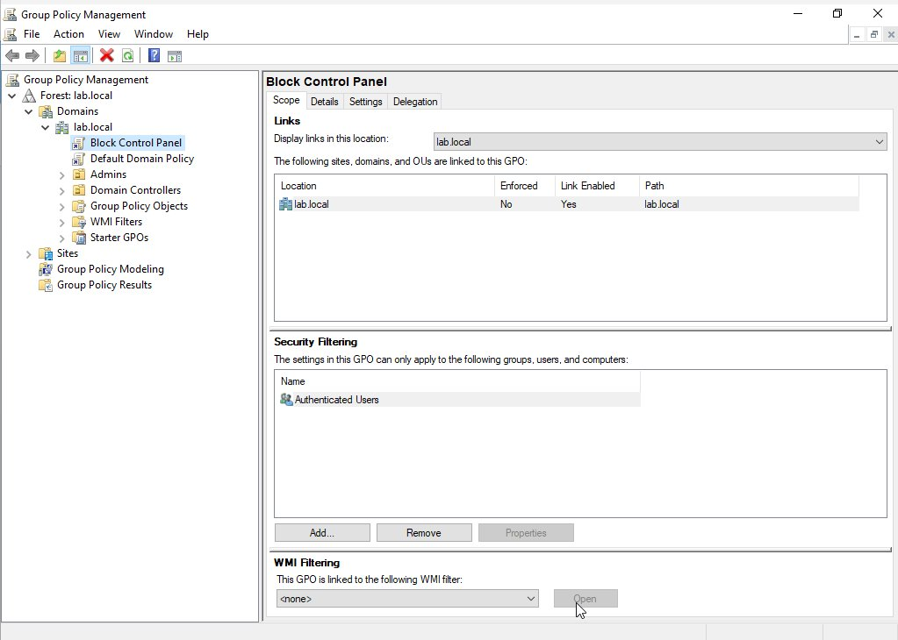
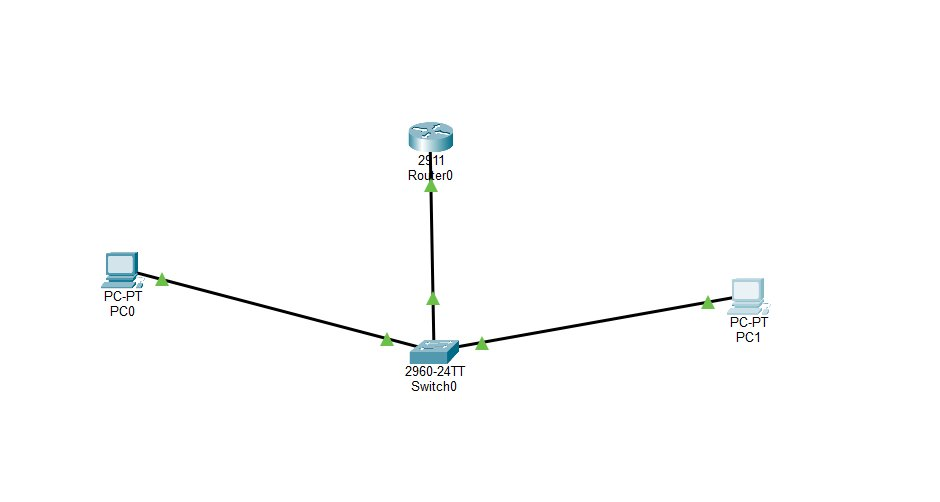
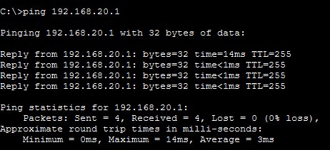

# 🖥️ Home Lab: Enterprise Network & Active Directory Infrastructure


> Built a fully functional enterprise-grade network lab from scratch — simulating real-world IT infrastructure including Active Directory, DNS, DHCP, Group Policy, VLANs, and inter-VLAN routing.

---

## 📋 Table of Contents

- [Overview](#overview)
- [Lab Environment](#lab-environment)
- [Architecture](#architecture)
- [Part 1 — Domain Controller (DC01)](#part-1--domain-controller-dc01)
- [Part 2 — Client Machine (PC01)](#part-2--client-machine-pc01)
- [Part 3 — DHCP Server](#part-3--dhcp-server)
- [Part 4 — Active Directory Administration](#part-4--active-directory-administration)
- [Part 5 — Group Policy (GPO)](#part-5--group-policy-gpo)
- [Part 6 — Cisco Packet Tracer Network](#part-6--cisco-packet-tracer-network)
- [Troubleshooting Challenges](#troubleshooting-challenges)
- [Skills Demonstrated](#skills-demonstrated)
- [IP Addressing Table](#ip-addressing-table)

---

## Overview

This lab simulates the core infrastructure of a real corporate IT environment. Every component was built, configured, and verified hands-on — from promoting a bare Windows Server to a Domain Controller, to configuring inter-VLAN routing on Cisco hardware in Packet Tracer.

**Host Machine:** AMD Ryzen 5 | 8GB RAM | Oracle VirtualBox

---

## Lab Environment

| Component | Details |
|-----------|---------|
| Hypervisor | Oracle VirtualBox 7.0 |
| Domain Controller OS | Windows Server 2022 Standard Evaluation |
| Client OS | Windows 10 Pro |
| Network Simulator | Cisco Packet Tracer |
| Domain | lab.local |
| DC01 IP | 192.168.10.10 (static) |
| PC01 IP | 192.168.10.100 (DHCP) |

---

## Architecture

```
                        LAB.LOCAL DOMAIN
                    ┌───────────────────────┐
                    │   DC01 (192.168.10.10) │
                    │   Windows Server 2022  │
                    │   AD DS | DNS | DHCP   │
                    └──────────┬────────────┘
                               │ Internal Network (labnet)
                    ┌──────────┴────────────┐
                    │   PC01 (DHCP: .100)   │
                    │   Windows 10 Pro      │
                    │   Domain: lab.local   │
                    └───────────────────────┘

        CISCO PACKET TRACER — VLAN TOPOLOGY
        
        [Router 2911]
             │ G0/0 trunk (dot1q)
        [Switch 2960]
          /          \
       Fa0/1        Fa0/2
      VLAN 10      VLAN 20
   192.168.10.x  192.168.20.x
   [Server PC]   [Client PC]
```

---

## Part 1 — Domain Controller (DC01)

**Objective:** Deploy Windows Server 2022, configure networking, install AD DS + DNS, and promote to Domain Controller.

**Steps completed:**
- Created VM with 2 vCPUs, 2GB RAM, 50GB disk in VirtualBox
- Installed Windows Server 2022 Standard (Desktop Experience)
- Configured static IP: `192.168.10.10 / 255.255.255.0`
- Renamed server to `DC01`
- Installed roles: **Active Directory Domain Services**, **DNS Server**, **Group Policy Management**
- Promoted to Domain Controller — created new forest: `lab.local`
- Verified AD and DNS via ADUC and DNS Manager

### ✅ Active Directory Users and Computers



> ADUC showing lab.local domain structure with custom OUs (Admins), security groups (GG-IT-Admins, GG-Staff), and domain user John Doe.

### ✅ DNS Manager — lab.local Zone



> Forward Lookup Zone for lab.local showing DC01 (192.168.10.10) and PC01 (192.168.10.100) DNS records — both registered automatically after domain join and DHCP lease.

---

## Part 2 — Client Machine (PC01)

**Objective:** Deploy Windows 10 Pro, join it to lab.local domain, verify domain authentication.

**Steps completed:**
- Created VM: 2 vCPUs, 2GB RAM, 50GB disk
- Installed Windows 10 Pro (Home edition cannot join a domain)
- Configured NIC on same Internal Network (`labnet`) as DC01
- Set DNS to `192.168.10.10` — pointed directly at DC
- Verified connectivity: `ping 192.168.10.10` ✅
- Verified DNS: `nslookup lab.local` → resolved to `192.168.10.10` ✅
- Joined domain: `lab.local`
- Logged in as domain user: `LAB\Administrator` and `LAB\jdoe`

### ✅ Domain Login Screen — LAB\Administrator



> PC01 login screen showing LAB\Administrator — confirming the machine is domain-joined and authenticating against DC01.

### ✅ Domain Login Screen — John Doe (jdoe)



> Successful domain login as LAB\jdoe — a standard domain user created in Active Directory.

---

## Part 3 — DHCP Server

**Objective:** Install DHCP role on DC01, create a scope, and verify automatic IP assignment to PC01.

**Steps completed:**
- Installed DHCP Server role on DC01
- Completed DHCP post-install authorization
- Created scope: `192.168.10.100 – 192.168.10.200`
- Configured scope options:
  - Option 003 (Router/Gateway): `192.168.10.1`
  - Option 006 (DNS Server): `192.168.10.10`
  - Option 015 (Domain Name): `lab.local`
- Activated scope
- Switched PC01 NIC to DHCP → received `192.168.10.100`

### ✅ DHCP Address Lease — PC01



> DHCP console showing active lease for PC01 (DESKTOP-PIPLQBT) at 192.168.10.100 — lease expiry June 5, 2026.

### ✅ ipconfig /all — PC01 Showing DHCP Assignment



> Full network config of PC01 — DHCP enabled, IP 192.168.10.100, DNS suffix lab.local, DHCP Server 192.168.10.10. Logged in as `C:\Users\jdoe`.

---

## Part 4 — Active Directory Administration

**Objective:** Build real AD structure with OUs, users, and security groups.

**Completed:**

| Object | Name | Details |
|--------|------|---------|
| OU | Admins | Custom OU for admin accounts |
| User | jdoe (John Doe) | Standard domain user |
| Group | GG-IT-Admins | Global Security Group |
| Group | GG-Staff | Global Security Group |
| Membership | jdoe → GG-Staff | User added to staff group |

---

## Part 5 — Group Policy (GPO)

**Objective:** Create and enforce a GPO that restricts access to Control Panel on domain machines.

**Steps completed:**
- Opened Group Policy Management Console
- Created GPO: `Block Control Panel` linked to `lab.local`
- Configured: `User Configuration → Administrative Templates → Control Panel → Prohibit access to Control Panel and PC settings → Enabled`
- On PC01 (logged in as jdoe): ran `gpupdate /force`
- Verified: Control Panel access blocked ✅

### ✅ Group Policy Management — Block Control Panel GPO



> GPO "Block Control Panel" linked to lab.local domain, Link Enabled: Yes. Applied to Authenticated Users — affects all domain users including jdoe.

---

## Part 6 — Cisco Packet Tracer Network

**Objective:** Build a routed LAN topology with VLANs and inter-VLAN routing to simulate the network infrastructure that supports the AD lab.

**Topology:**
- 1x Cisco 2911 Router
- 1x Cisco 2960-24TT Switch
- 2x End devices (Server PC — VLAN 10, Client PC — VLAN 20)

**Configuration completed:**

**Switch (2960):**
- Created VLAN 10 (SERVERS) and VLAN 20 (CLIENTS)
- Assigned Fa0/1 → VLAN 10 (access), Fa0/2 → VLAN 20 (access)
- Set Gi0/1 → trunk port (allowed VLANs 10, 20)

**Router (2911) — Router-on-a-Stick:**
- G0/0.10: `encapsulation dot1q 10` → `192.168.10.1/24`
- G0/0.20: `encapsulation dot1q 20` → `192.168.20.1/24`
- Configured DHCP pools for both VLANs

### ✅ Packet Tracer Topology — All Links Up



> Full topology showing Router0 (2911) connected via trunk to Switch0 (2960), with PC0 in VLAN 10 (192.168.10.x) and PC1 in VLAN 20 (192.168.20.x). All links green = active.

### ✅ Inter-VLAN Ping — 0% Packet Loss



> Successful ping from VLAN 20 client (192.168.20.x) to VLAN 10 server (192.168.20.1 gateway) — 4/4 packets received, 0% loss, confirming inter-VLAN routing is fully operational.

---

## Troubleshooting Challenges

These are real issues encountered and resolved during the build — not a clean run from a tutorial.

| Issue | Cause | Resolution |
|-------|-------|------------|
| `nslookup lab.local` timing out from PC01 | PC01 had IPv6 DNS address taking priority over IPv4 | Disabled IPv6 on PC01 NIC, flushed DNS cache |
| Ping to DC01 failing from PC01 | Windows Firewall on DC01 blocking ICMP | Added inbound ICMP allow rule via `netsh advfirewall` |
| DNS still failing after firewall fix | DC01 DNS listening on IPv6 (`::1`) instead of IPv4 | Configured DNS Manager to listen only on `192.168.10.10` |
| VMs not communicating | PC01 NIC had no Internal Network name assigned | Set PC01 NIC to Internal Network `labnet` — matching DC01 |
| Inter-VLAN ping failing in Packet Tracer | Switch trunk port not correctly configured | Identified correct port via `show interfaces status`, reconfigured trunk on Fa0/3 |
| Router setup wizard blocking CLI access | Initial config dialog intercepting commands | Used `Ctrl+C` to break out, then entered `enable` → `configure terminal` |

---

## Skills Demonstrated

```
Infrastructure          Networking              Administration
─────────────────       ──────────────────      ──────────────────
✅ VM deployment        ✅ VLAN configuration   ✅ AD user management
✅ Windows Server 2022  ✅ Inter-VLAN routing   ✅ OU structure design
✅ Static IP config     ✅ Router-on-a-stick    ✅ Security groups
✅ Role installation    ✅ Trunk port config    ✅ GPO creation
✅ Domain promotion     ✅ DHCP scope setup     ✅ Policy enforcement
✅ DNS configuration    ✅ Network topology     ✅ Troubleshooting
```

---

## IP Addressing Table

| Device | Role | IP Address | Subnet Mask | Gateway | DNS |
|--------|------|------------|-------------|---------|-----|
| DC01 | Domain Controller | 192.168.10.10 | 255.255.255.0 | 192.168.10.1 | 192.168.10.10 |
| PC01 | Domain Client | 192.168.10.100 (DHCP) | 255.255.255.0 | 192.168.10.1 | 192.168.10.10 |
| Router G0/0.10 | VLAN 10 Gateway | 192.168.10.1 | 255.255.255.0 | — | — |
| Router G0/0.20 | VLAN 20 Gateway | 192.168.20.1 | 255.255.255.0 | — | — |
| PT Server PC | VLAN 10 End Device | 192.168.10.2 | 255.255.255.0 | 192.168.10.1 | — |
| PT Client PC | VLAN 20 End Device | 192.168.20.2 | 255.255.255.0 | 192.168.20.1 | — |

---

## Tools Used

- Oracle VirtualBox 7.0
- Windows Server 2022 Standard Evaluation
- Windows 10 Pro
- Cisco Packet Tracer
- Active Directory Users and Computers (ADUC)
- Group Policy Management Console (GPMC)
- DNS Manager
- DHCP Console
- Windows Command Prompt / PowerShell

---

*Built as part of a self-directed home lab project to develop hands-on IT infrastructure skills.*
